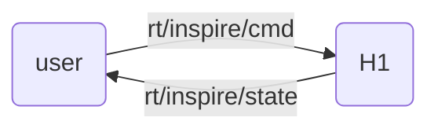

## Dexterous Hand

Unitree H1 can be equipped with [Inspire Robotics](https://inspire-robots.com/product/frwz/)'s dexterous hand, which has **six degrees of freedom** and 12 motion joints to mimic the human hand for complex movements.


## 

The user can control the hand by publish the **"unitree_go::msg::dds::MotorCmds_"** message to the topic **"rt/inspire/cmd"**, and get the hand state by subscribe the **"unitree_go::msg::dds::MotorStates_"** message from the topic **"rt/inspire/state"**.



+ IDL Message Type

Motor data in array format, containing 12 motor data for both hands.

!!!note
Currently the dexterous hand only supports joint control, i.e. only the parameter q makes sense in the idl format. The others are reserved.
!!!


```bash
# namespace unitree_go::msg::dds_

# unitree_go::msg::dds_::MotorCmds_
struct MotorCmds_ 
{
    sequence<unitree_go::msg::dds_::MotorCmd_> cmds;
};

# unitree_go::msg::dds_::MotorStates_
struct MotorCmds_ 
{
    sequence<unitree_go::msg::dds_::MotorState> states;
};
```
+ Joint Motor Sequence
  
<div style="text-align: center;">
<table border="1">
  <tr>
    <td>Id</td>
    <td>0</td>
    <td>1</td>
    <td>2</td>
    <td>3</td>
    <td>4</td>
    <td>5</td>
    <td>6</td>
    <td>7</td>
    <td>8</td>
    <td>9</td>
    <td>10</td>
    <td>11</td>
  </tr>
  <tr>
    <td rowspan="2">Joint</td>
    <td colspan="6">Right Hand</td>
    <td colspan="6">Left Hand</td>
  </tr>
  <tr>
    <td>pinky</td>
    <td>ring</td>
    <td>middle</td>
    <td>index</td>
    <td>thumb-bend</td>
    <td>thumb-rotation</td>
    <td>pinky</td>
    <td>ring</td>
    <td>middle</td>
    <td>index</td>
    <td>thumb-bend</td>
    <td>thumb-rotation</td>
  </tr>
</table>
</div>