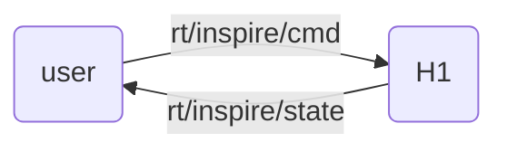

## 灵巧手介绍

H1可搭载[Inspire Robotics](https://inspire-robots.com/product/frwz/)的仿人五指灵巧手，该灵巧手具有6个自由度和12个运动关节，可以模拟人手实现复杂动作。


## 接口说明

**示例程序** [h1_example_hand.cpp]()

用户向 **"rt/inspire/cmd"** 话题发送 **"unitree_go::msg::dds::MotorCmds_"** 消息控制灵巧手。
从 **"rt/inspire/state"** 话题接受 **"unitree_go::msg::dds::MotorStates_"** 消息获取灵巧手状态。



+ IDL数据格式
采用数组格式的电机数据，内部包含双手12个电机数据。
```note
当前灵巧手只支持关节控制，即在idl格式中只有参数q有意义。其他保留。
```

```bash
# namespace unitree_go::msg::dds_

# unitree_go::msg::dds_::MotorCmds_
struct MotorCmds_ 
{
    sequence<unitree_go::msg::dds_::MotorCmd_> cmds;
};

# unitree_go::msg::dds_::MotorStates_
struct MotorCmds_ 
{
    sequence<unitree_go::msg::dds_::MotorState> states;
};
```


+ IDL中的关节顺序
<div style="text-align: center;">
<table border="1">
  <tr>
    <td>Id</td>
    <td>0</td>
    <td>1</td>
    <td>2</td>
    <td>3</td>
    <td>4</td>
    <td>5</td>
    <td>6</td>
    <td>7</td>
    <td>8</td>
    <td>9</td>
    <td>10</td>
    <td>11</td>
  </tr>
  <tr>
    <td rowspan="2">Joint</td>
    <td colspan="6">Right Hand</td>
    <td colspan="6">Left Hand</td>
  </tr>
  <tr>
    <td>pinky</td>
    <td>ring</td>
    <td>middle</td>
    <td>index</td>
    <td>thumb-bend</td>
    <td>thumb-rotation</td>
    <td>pinky</td>
    <td>ring</td>
    <td>middle</td>
    <td>index</td>
    <td>thumb-bend</td>
    <td>thumb-rotation</td>
  </tr>
</table>
</div>